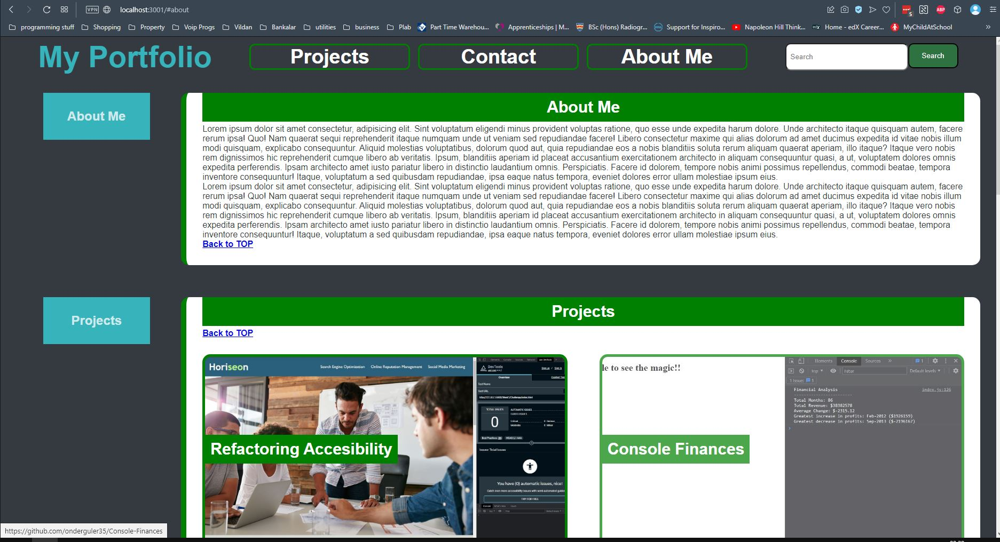

# React Portfolio Challenge
     

## Description
This is my first react portfolio project.
I will add to his portfolio as I learn new technologies and skills. And will try to convert my other challenges and projects into react as well.

Here is a screenshot of the project:

## Usage
 
To check my other development projects please visit my [Github](https://github.com/onderguler35)   
If you would like to contact me please do not hesitate to [send and email](mailto:onder5@hotmail.com)  

## Features

## Credits
Thanks to my teaching team at the bootcamp. And as always [w3schools](https://www.w3schools.com) helped a lot with their tutorials.

## Licence 
This project is shared under 
